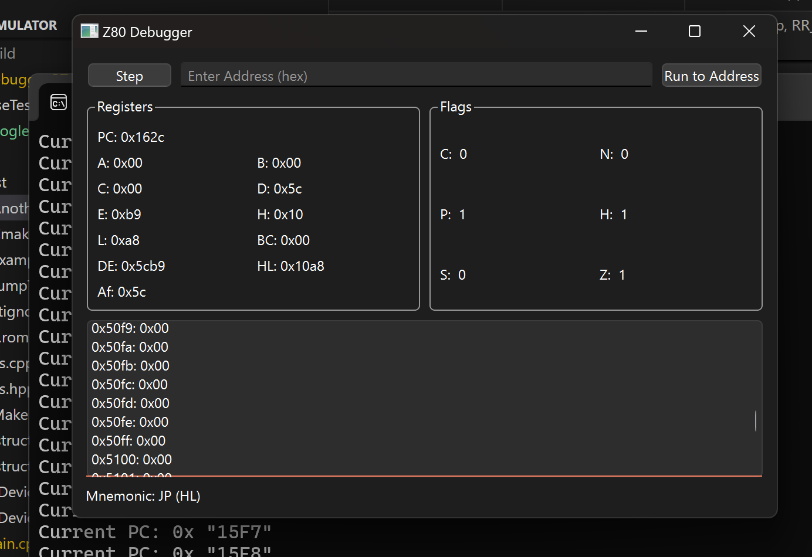
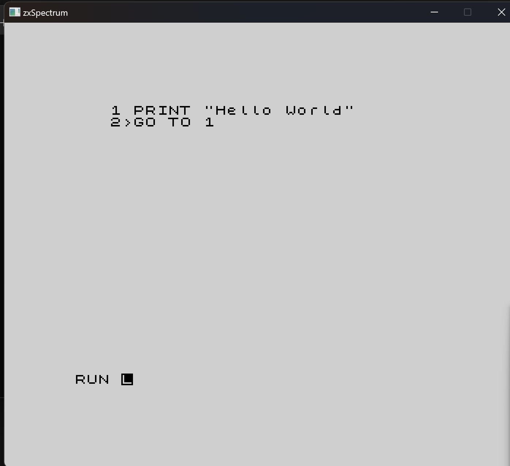
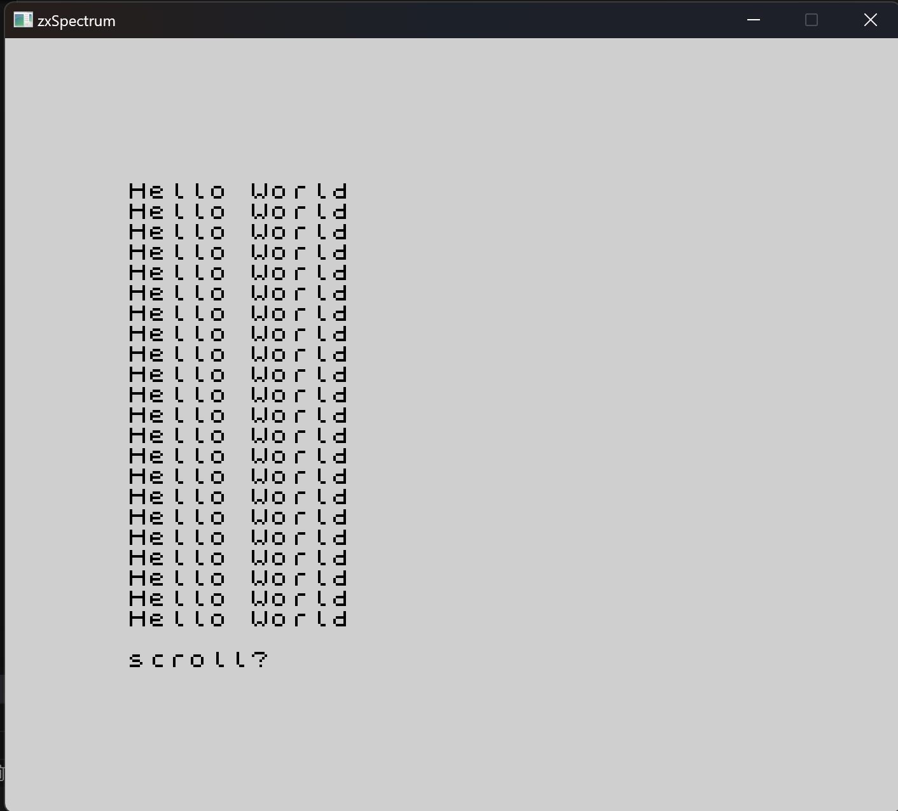

# Z80-Emulator

## Description
The **Z80 Emulator** is a fully-featured emulator for the Z80 microprocessor, developed using a **test-driven development (TDD)** approach to ensure reliability and correctness. The emulator was extensively validated using **Fuse emulator tests**, which were integrated directly into the project for thorough testing and verification. 

## Current Limitations
While the emulator is functional and can successfully boot the ZX Spectrum ROM, there are a few features that are not yet supported:
- **Clock Accuracy**: The emulation is not cycle-accurate and does not currently model clock timing precisely.
- **Undocumented fetures**: Not all undocumented features of the cpu are fully implemented.

In addition to the core emulation functionality, the project includes a **debugger** with a graphical user interface (GUI) built using **Qt**, allowing users to inspect and manipulate the emulation state with ease.

---

## Features
- **Z80 Processor Emulation**: Accurate emulation of the Z80 microprocessor, ensuring compatibility with Z80-based systems.
- **Test-Driven Development**: The emulator was built using TDD practices.
- **Validation with Fuse Tests**: Integrated tests from the Fuse emulator project were used to verify the emulator's accuracy and performance.
- **Debugger with Qt GUI**: A user-friendly debugger with a Qt-based interface for debugging and inspecting Z80 programs.

ZXspectrum running using the emulated cpu

